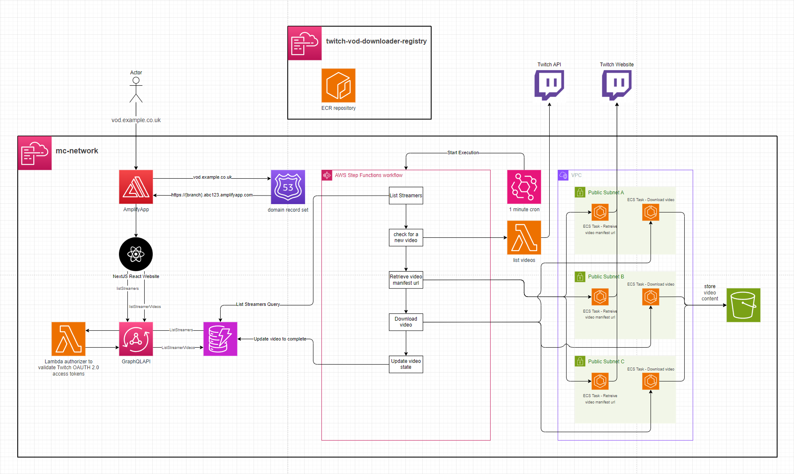
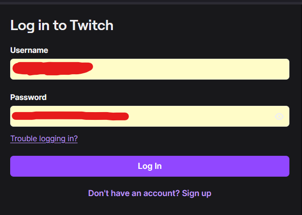
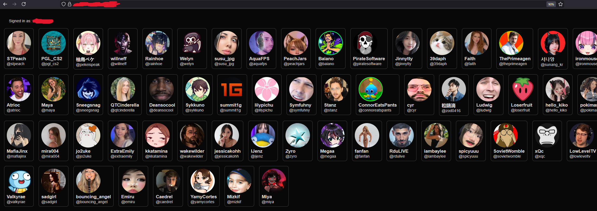
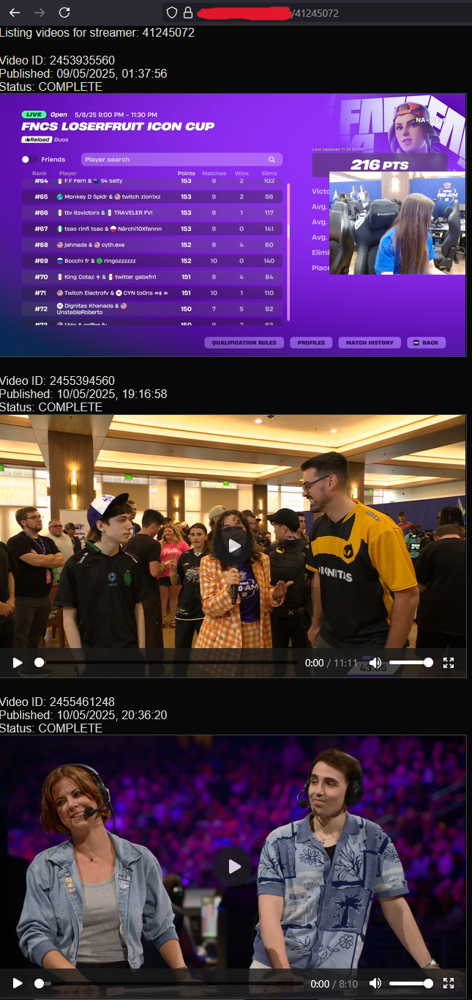

# twitch-vod-downloader

[Twitch](https://www.twitch.tv/) is a livestreaming platform that allows content creators to livestream video to their Twitch channel for people to view and interact with. When a livestream ends, it is then made available as a VOD (Video On Demand) to be watched by people who missed the livestream.

Twitch only allows previous broadcasts to be available for 7 days, or 60 days for their Twitch Partners. After this period, the broadcast is no longer available and, unless downloaded by the streamer, it effectively becomes lost media.

This system is intended to support the automatic archival of content creators' livestreams by downloading the VOD asset and enabling rewatching it from a user interface.



# Setup

See `.gitlab-ci.yml` for automated deployment.

1. This application supports logging in by deferring to Twitch via OAuth 2.0. Deploying this application will require registering a [Twitch Developer App](https://dev.twitch.tv/docs/authentication/register-app/) and then creating a `Confidential` Twitch application. You will need to create an AWS Secrets Manager secret with the format:
```json
{
  "clientId": "{your client id}",
  "clientSecret": "{your client secret}",
  "url": "https://id.twitch.tv/oauth2/token"
}
```
2. **Deploy** the `container-registry.yaml` CloudFormation stack to host the ECR images. E.g. `sam deploy --no-fail-on-empty-changeset --template-file container-registry.yaml --stack-name twitch-vod-downloader-registry --s3-bucket $S3_DEPLOY --capabilities CAPABILITY_NAMED_IAM --region eu-west-1`
3. **Build** the `Manifest` and `DownloadVideo` docker images and push them to the ECR repository from step 2. The image tags should be `Manifest` and `DownloadVideo` to match what the ECS task definitions in `template.yaml` expect.
4. **Deploy** the `template.yaml` with a `Domain`, `HostedZoneId`, `DomainCert` & optionally `DomainPrefix` for Amplify to be configured with a Route53 domain. The `AmplifyAppRepoURL`, `AmplifyAppRepoBranch` & `AmplifyAppRepoToken` Parameters need to be provided for Amplify to build the frontend. The `TwitchCredentialsSecretPath` parameter needs to be specified, which is the ARN of the Secret created in step 1 and the `ImageUri` parameter will need to be provided as the ECR repository URI for ECS to fetch the docker images.

# Frontend
The frontend UI integrates with Twitch using an OIDC Cognito Identity Provider. Visiting the frontend redirects you to the Twitch login. After signing in, Twitch redirects you back to the application.


You are then presented with a list of Twitch Streamers that the application is archiving the VODs for.


Clicking on a Twitch Streamer will load a list of their videos which have been downloaded and are ready to view.


## Registering a Streamer
Registering a new Streamer can be done by making this Appsync mutation
```graphql
mutation MyMutation {
  createStreamer(username: "pokimane") {
    pk
    sk
    userDisplayName
    userProfileImageUrl
    userName
    userId
  }
}
```

## Dockerized puppeteer webbot
A key piece of this system is taking the url of the Streamer's video and retrieving the HLS manifest url of that video. Twitch's API does not allow this, resulting in a dockerized ECS puppeteer bot which loads the page & intercepts traffic for the HLS manifest url.

## Data structures
### Streamer
```json
{
 "pk": "STREAMER",
 "sk": "STREAMER#44445592",
 "userDisplayName": "pokimane",
 "userId": "44445592",
 "userName": "pokimane",
 "userProfileImageUrl": "https://static-cdn.jtvnw.net/jtv_user_pictures/912232e8-9e53-4fb7-aac4-14aed07869ca-profile_image-300x300.png"
}
```

### Video
```json
{
 "pk": "VIDEO#44445592",
 "sk": "VIDEO#2458896948",
 "processedManifestUri": "s3://twitch-vod-downloader-video-bucket/44445592/2458896948/index.m3u8",
 "processedManifestUrl": "https://djpcyzz1kzchy.cloudfront.net/44445592/2458896948/index.m3u8",
 "twitchManifestUrl": "https://d2nvs31859zcd8.cloudfront.net/d3c2fadcaee0a608c2d6_pokimane_321069980156_1747261099/chunked/index-dvr.m3u8",
 "twitchVideoUrl": "https://www.twitch.tv/videos/2458896948",
 "userId": "44445592",
 "videoDuration": "11m47s",
 "videoId": "2458896948",
 "videoProcessingStatus": "COMPLETE",
 "videoPublishedTime": "2025-05-14T22:18:25Z"
}
```
